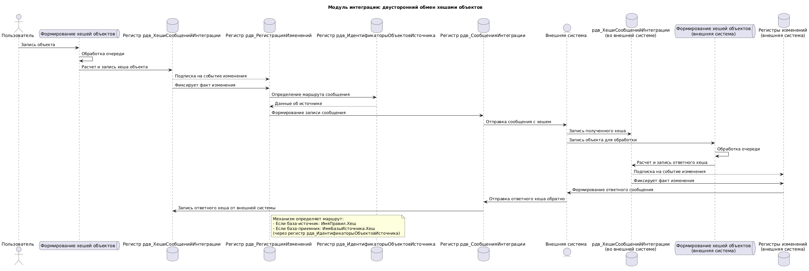

### Настройка
- `Константы.рдв_ИнтеграцияКонтролироватьЦелостностьДанных` - включает режим контроля данных, подсистема сохраняет контрольную сумму выгружаемого объекта, для сверки с внешней системой
### Настройка алгоритма расчета
- ОбщийМодуль.ЗаполнитьПравилаРегистрации. Для всех внешних систем добавить безусловную регистрацию ВыгружаемыеОбъекты.
```
Процедура ЗаполнитьПравилаРегистрации(ПравилаРегистрации) Экспорт
ВнешняяСистемы = Справочники.рдв_ВнешниеСистемы.Предопределенный("Имя");

...

ДобавитьПравилоРегистрации(ПравилаРегистрации, 
Метаданные.Справочники.рдв_ВыгружаемыеОбъекты, 
ВнешняяСистемы,
"АдресМетода",
"ВыгружаемыеОбъекты");
...
КонецПроцедуры

Процедура ДобавитьПравилоРегистрации(ПравилаРегистрации, 
										МетаданныеОбъекта, 
										ВнешняяСистема,  
										АдресМетода = "", 
										ИмяВидаСообщения = "")

	ВидСообщения = Неопределено;
	
	Если ЗначениеЗаполнено(ИмяВидаСообщения) Тогда
		ВидСообщения = Справочники.рдв_ВидыСообщенийИнтеграции.ПолучитьВидСообщения(ИмяВидаСообщения);
	КонецЕсли;
											
	ПравилоРегистрации = ПравилаРегистрации.Добавить();
	ПравилоРегистрации.МетаданныеОбъекта = МетаданныеОбъекта;
	ПравилоРегистрации.ВнешняяСистема = ВнешняяСистема;
	ПравилоРегистрации.АдресМетода = АдресМетода;
	ПравилоРегистрации.ВидСообщения = ВидСообщения;
	
КонецПроцедуры

```
- ОбщийМодуль.рдв_КонтрольЦелостностиДанныхПереопределяемый
```
// Описывает правила по которым будет рассчитан хеш объекта
// Если не будут заданы, то возможен расчет в методе ХешРассчитать
// по произвольному алгоритму
Функция ПравилаРасчетаХеша(ОбъектМетаданных, ПравилоКонвертации) Экспорт
	
	Если ОбъектМетаданных = Метаданные.Документы._ДемоЗаказПокупателя Тогда
		// На основании правил конвертации получили правила хеша
		ПравилаРасчетаХеша = рдв_КонтрольЦелостностиДанных.ПравилаРасчетаХешаИзПравилКонвертации(ПравилоКонвертации);
		
		Шапка = ПравилаРасчетаХеша.Шапка;
		ТабличныеЧасти = ПравилаРасчетаХеша.ТабличныеЧасти;
		
		// Изменили правила для относительное правил конвертации
		// для указанных реквизитов
		КлючевыеПоля_ДемоКонтрагенты(Шапка);
		КлючевыеПоля_ДемоДоговорыКонтрагентов(Шапка);
		
		Возврат ПравилаРасчетаХеша;

	// Формируем правила по произвольному алгоритму
	ИначеЕсли ОбъектМетаданных = Метаданные.Справочники._ДемоПартнеры Тогда
		
		ПравилаРасчетаХеша = рдв_КонтрольЦелостностиДанных.ПравилаРасчетаХешаИнициализировать();
		Шапка = ПравилаРасчетаХеша.Шапка;
		рдв_КонтрольЦелостностиДанных.ПравилаРасчетаХешаДобавитьПоле(Шапка, "Код");
		рдв_КонтрольЦелостностиДанных.ПравилаРасчетаХешаДобавитьПоле(Шапка, "Наименование");
		
		ТЧ = рдв_КонтрольЦелостностиДанных.ПравилаРачетаХешаДобавитьТабличнуюЧасть(ПравилаРасчетаХеша
																						, "КонтактнаяИнформация");
		рдв_КонтрольЦелостностиДанных.ПравилаРасчетаХешаДобавитьПоле(ТЧ, "Тип");
		рдв_КонтрольЦелостностиДанных.ПравилаРасчетаХешаДобавитьПоле(ТЧ, "Вид");
		рдв_КонтрольЦелостностиДанных.ПравилаРасчетаХешаДобавитьПоле(ТЧ, "Представление");
		
		Возврат ПравилаРасчетаХеша;
		
	КонецЕсли;
	
КонецФункции

```
- действия выше приведут к тому что:
	- будет сформировано сообщение обмена с набор служебных данных, в том числе с данными хеша
	- внешняя система (если 1с), запишет хеши в регистр рдв_ХешиСообщенийИнтеграции
	- внешняя система (если 1с) сериализует сообщение, рассчитает хеши полученных объектов, запишет в регистр рдв_ХешиСообщенийИнтеграции
	- сформирует служебное сообщение, куда поместит свои хеши
	- в итоге базы источник и приемник будут содержать хеши друг друга
	- сверить данные можно через отчет __рдв_СверкаПолнотыТочностиДанных__

### Схема формирования хеша




```
@startuml

title Модуль интеграции: двусторонний обмен хешами объектов

actor "Пользователь" as User

queue "Формирование хешей объектов" as HashQueue

database "Регистр рдв_ХешиСообщенийИнтеграции" as HashReg
database "Регистр рдв_РегистрацияИзменений" as ChangeReg
database "Регистр рдв_ИдентификаторыОбъектовИсточника" as IdReg
database "Регистр рдв_СообщенияИнтеграции" as MessageReg

entity "Внешняя система" as ExternalSystem
database "рдв_ХешиСообщенийИнтеграции\n(во внешней системе)" as ExternalHashReg
queue "Формирование хешей объектов\n(внешняя система)" as ExternalHashQueue
database "Регистры изменений\n(внешняя система)" as ExternalChangeReg

User -> HashQueue : Запись объекта
HashQueue -> HashQueue : Обработка очереди
HashQueue -> HashReg : Расчет и запись хеша объекта

HashReg --> ChangeReg : Подписка на событие изменения
HashReg -> ChangeReg : Фиксирует факт изменения

ChangeReg -> IdReg : Определение маршрута сообщения
IdReg --> ChangeReg : Данные об источнике

ChangeReg -> MessageReg : Формирование записи сообщения
MessageReg -> ExternalSystem : Отправка сообщения с хешем

ExternalSystem -> ExternalHashReg : Запись полученного хеша

ExternalSystem -> ExternalHashQueue : Запись объекта для обработки
ExternalHashQueue -> ExternalHashQueue : Обработка очереди
ExternalHashQueue -> ExternalHashReg : Расчет и запись ответного хеша

ExternalHashReg --> ExternalChangeReg : Подписка на событие изменения
ExternalHashReg -> ExternalChangeReg : Фиксирует факт изменения

ExternalChangeReg -> ExternalSystem : Формирование ответного сообщения
ExternalSystem -> MessageReg : Отправка ответного хеша обратно

MessageReg -> HashReg : Запись ответного хеша от внешней системы

note right of ChangeReg
  Механизм определяет маршрут:
  - Если база-источник: ИмяПравил.Хеш
  - Если база-приемник: ИмяБазыИсточника.Хеш
  (через регистр рдв_ИдентификаторыОбъектовИсточника)
end note

@enduml

```
