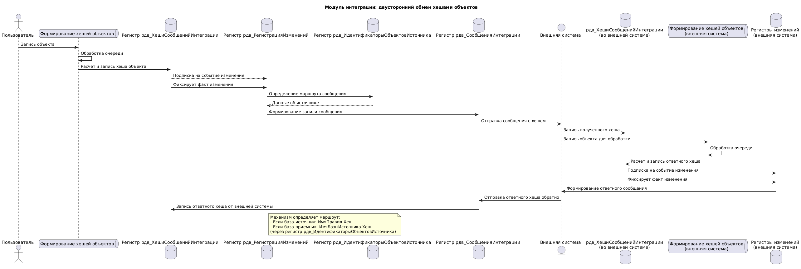

### Процесс формирования сообщения
#### Фиксация события изменения

**Что происходит:** При изменении состояния любого отслеживаемого объекта (как ссылочный объект, так и запись регистра) срабатывает событие через подписки на события модуля отвечающего за бизнес логику пример `рдв_МодульИнтеграцииДемо`

  - `рдв_СправочникиПриЗаписи`
  - `рдв_ДокументыПриЗаписи`
  - `рдв_НаборыЗаписейПриЗаписи`

**Действие:** Система определяет, подлежит ли объект выгрузке, и формирует или использует существующую запись в контейнере _Справочник.рдв_ВыгружаемыеОбъекты_.
    
  > Для каждого уникального объекта события (например, конкретный контрагент или запись регистра) существует только одна запись в _Справочник.рдв_ВыгружаемыеОбъекты_, независимо от количества изменений.

#### Постановка в очередь на обработку

**Что происходит:** Событие о необходимости выгрузки объекта фиксируется в регистре сведений `рдв_РегистрацияИзменений`.  
**Действие:** Очередь для дальнейшей обработки изменений и передачи их в следующий этап.

#### Контроль целостности данных
**Что происходит:** при отработке подписки на изменение объекта, если значение константы `рдв_ФормироватьХешОбъектов` включено то создается запись в регистр с типом очереди `Сформировать хеш объектов`.
**Действие:** формируются хеши объектов при обработке очереди и формируются записи в `рдв_РегистрацияИзменений` для формирования служебных сообщений.

#### Формирование сообщений
**Что происходит:** считывание данные `рдв_РегистрацияИзменений` для формирования записей сообщений в `рдв_СообщенияИнтеграции`.  
**Действие:** формируются сообщения согласно правил конвертации в разрезе внешних систем, для последующей отправки.

### Схема процесса передачи если выключено формирование хеша


```
@startuml

title Модуль интеграции: обмен сообщениями без расчета хешей

actor "Пользователь" as User

database "Регистр рдв_РегистрацияИзменений" as ChangeReg
database "Регистр рдв_ИдентификаторыОбъектовИсточника" as IdReg
database "Регистр рдв_СообщенияИнтеграции" as MessageReg

entity "Внешняя система" as ExternalSystem
database "Регистры изменений\n(внешняя система)" as ExternalChangeReg

User -> ChangeReg : Запись объекта


ChangeReg -> IdReg : Определение маршрута сообщения
IdReg --> ChangeReg : Данные об источнике

ChangeReg -> MessageReg : Формирование записи сообщения
MessageReg -> ExternalSystem : Отправка сообщения

ExternalSystem -> ExternalChangeReg : Обработка полученного сообщения
ExternalChangeReg -> ExternalSystem : Формирование ответного сообщения
ExternalSystem -> MessageReg : Отправка ответа обратно

note right of ChangeReg
  Механизм определяет маршрут:
  - Если база-источник: ИмяПравил.Хеш
  - Если база-приемник: ИмяБазыИсточника.Хеш
  (через регистр рдв_ИдентификаторыОбъектовИсточника)
end note

@enduml
```

### Схема процесса передачи если включено формировании хеша




```
@startuml

title Модуль интеграции: двусторонний обмен хешами объектов

actor "Пользователь" as User

queue "Формирование хешей объектов" as HashQueue

database "Регистр рдв_ХешиСообщенийИнтеграции" as HashReg
database "Регистр рдв_РегистрацияИзменений" as ChangeReg
database "Регистр рдв_ИдентификаторыОбъектовИсточника" as IdReg
database "Регистр рдв_СообщенияИнтеграции" as MessageReg

entity "Внешняя система" as ExternalSystem
database "рдв_ХешиСообщенийИнтеграции\n(во внешней системе)" as ExternalHashReg
queue "Формирование хешей объектов\n(внешняя система)" as ExternalHashQueue
database "Регистры изменений\n(внешняя система)" as ExternalChangeReg

User -> HashQueue : Запись объекта
HashQueue -> HashQueue : Обработка очереди
HashQueue -> HashReg : Расчет и запись хеша объекта

HashReg --> ChangeReg : Подписка на событие изменения
HashReg -> ChangeReg : Фиксирует факт изменения

ChangeReg -> IdReg : Определение маршрута сообщения
IdReg --> ChangeReg : Данные об источнике

ChangeReg -> MessageReg : Формирование записи сообщения
MessageReg -> ExternalSystem : Отправка сообщения с хешем

ExternalSystem -> ExternalHashReg : Запись полученного хеша

ExternalSystem -> ExternalHashQueue : Запись объекта для обработки
ExternalHashQueue -> ExternalHashQueue : Обработка очереди
ExternalHashQueue -> ExternalHashReg : Расчет и запись ответного хеша

ExternalHashReg --> ExternalChangeReg : Подписка на событие изменения
ExternalHashReg -> ExternalChangeReg : Фиксирует факт изменения

ExternalChangeReg -> ExternalSystem : Формирование ответного сообщения
ExternalSystem -> MessageReg : Отправка ответного хеша обратно

MessageReg -> HashReg : Запись ответного хеша от внешней системы

note right of ChangeReg
  Механизм определяет маршрут:
  - Если база-источник: ИмяПравил.Хеш
  - Если база-приемник: ИмяБазыИсточника.Хеш
  (через регистр рдв_ИдентификаторыОбъектовИсточника)
end note

@enduml

```